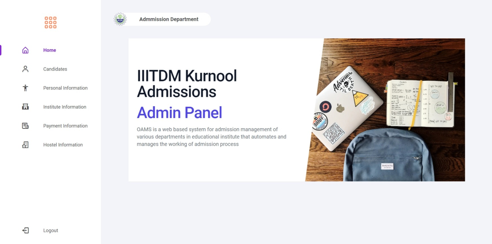
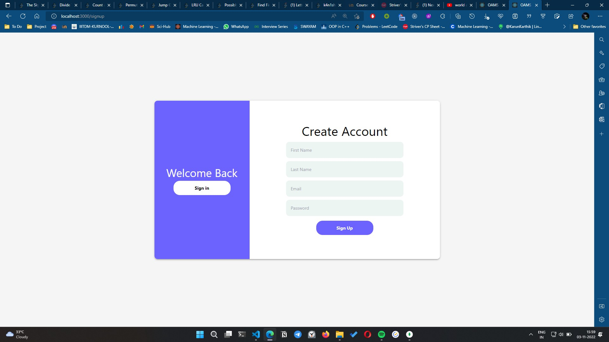
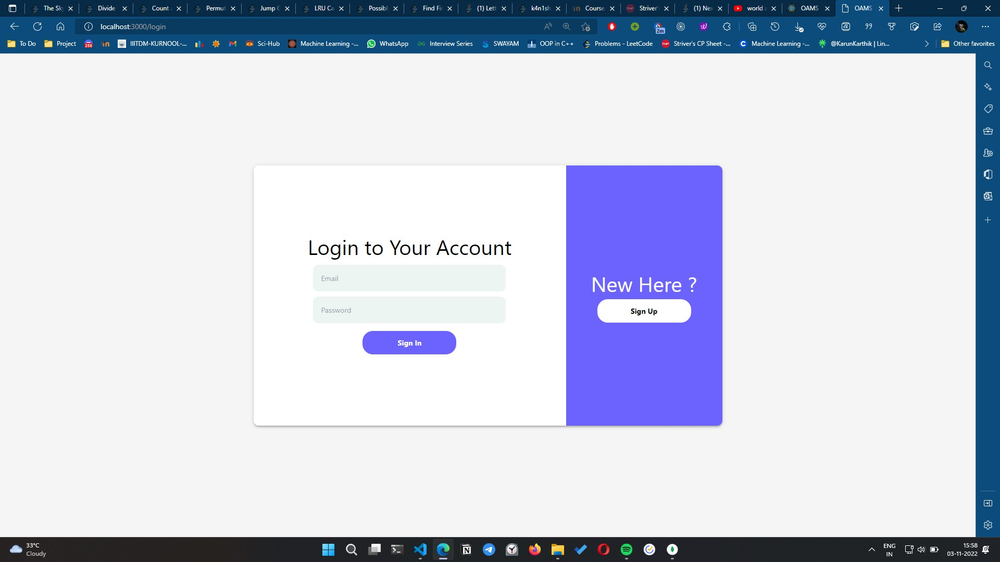
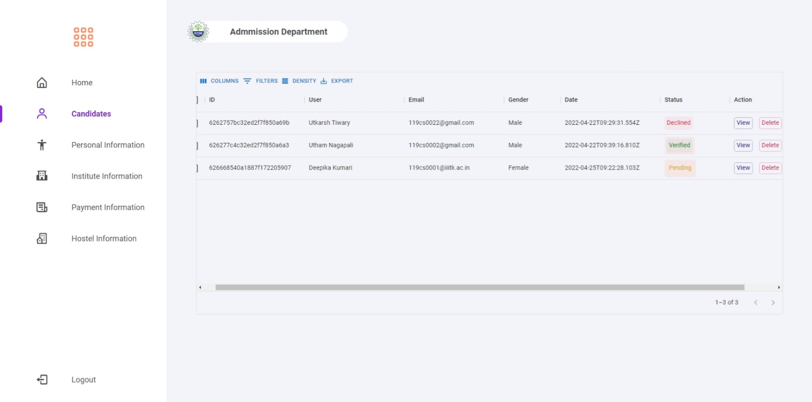

## Online Admission Management System

### **ADMIN SIDE**

### **Objective**

This is the admin side of online admission system. The admin can view following information of candidates - 

- Personal Information
- Academic Information
- Payment Information
- Hostem Information

The admin can Approve or Decline the form submitted by the candidates. Admin can adjust the information of details that are shown in the tables and download the table in form of PDF or excel sheet.

### **Features**

- JWT authorization is used for authentication
- MongoDB is used for storing all the data locally
- Express and NodeJS is used as a backend for server side
- React and Tailwind CSS is used for frontend
- React Router is used for routing all the requests
- JOI package is used for verifying data in forms
- Bcrypt is used for encrypting the password
- Used MaterialUI for tables

### **Screenshots**

#### **Home page**

 

#### **Signup page**

 

#### **Login page**

 

#### **Candidates page**

 
